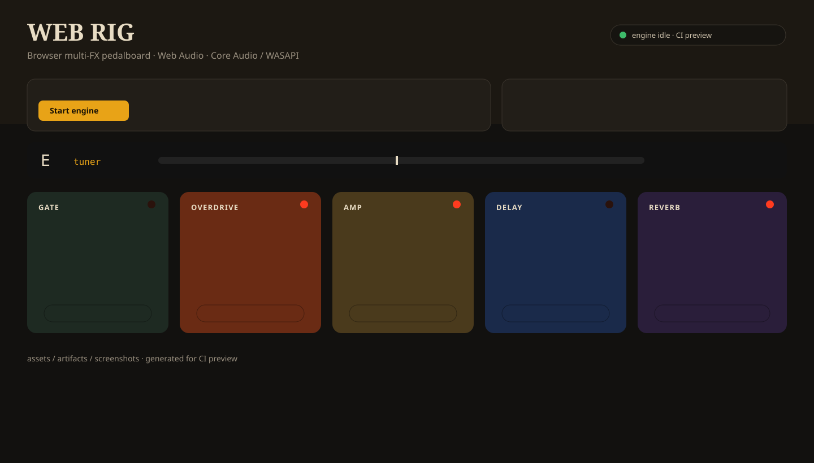

# Web Rig — Multi-FX Guitar Pedalboard

[](https://github.com/GizzZmo/web-rig-guitar-pedalboard/actions/workflows/ci.yml)
[](https://github.com/GizzZmo/web-rig-guitar-pedalboard/tree/main/assets)
[](https://github.com/GizzZmo/web-rig-guitar-pedalboard/actions/workflows/ci.yml)
[](https://github.com/GizzZmo/web-rig-guitar-pedalboard/actions/workflows/ci.yml)
[](LICENSE)

Browser multi-effects pedalboard for electric guitar. Processing runs in the tab with the Web Audio API.



- **macOS:** Web Audio → Core Audio  
- **Windows:** Web Audio → WASAPI (browsers cannot open ASIO)  
- **Live input** via `getUserMedia`, lowest-latency hints, voice processing off  
- Pedals: gate, compressor, overdrive, distortion, amp EQ, cabinet, chorus, delay, reverb, tuner, presets  

## Play it

HTTPS is required for the microphone.

- Pedalboard: https://cdn.jsdelivr.net/gh/GizzZmo/web-rig-guitar-pedalboard@main/index.html
- Vercel launcher: https://web-rig-guitar-pedalboard-gizzzmos-projects.vercel.app
- Repo: https://github.com/GizzZmo/web-rig-guitar-pedalboard

1. Plug the guitar into an audio interface **instrument / Hi-Z** input.  
2. Use headphones from the same interface.  
3. Prefer Chrome.  
4. Click **Start engine** and allow the microphone.  
5. Select that interface for both input and output.

Expected feel is roughly 12–30 ms round-trip, plus the interface buffer. That is playable for practice. It is not a 64-sample ASIO DAW.

To enable GitHub Pages at `https://gizzzmo.github.io/web-rig-guitar-pedalboard/`:
**Settings → Pages → Build and deployment → Source: GitHub Actions**, then re-run the Pages workflow.

## CI artifacts

Every push to `main` runs [`.github/workflows/ci.yml`](.github/workflows/ci.yml) and uploads three bundles:

| Badge | Artifact name | Contents |
|---|---|---|
| Assets | `assets` | `index.html`, license, `assets/` |
| Artifacts | `artifacts` | packaged `dist/` + `web-rig-assets.tar.gz` |
| Screenshots | `screenshots` | desktop, laptop, and mobile PNGs |

Open the latest CI run → **Artifacts** to download them.

```bash
npm run validate
```

## Run locally

```bash
python3 -m http.server 8080
# http://localhost:8080
```

Do not open the HTML as `file://` — Chrome will block the microphone.

## ASIO / Core Audio notes

A web page cannot load Steinberg ASIO. Chrome/Edge/Safari/Firefox own the device:

| OS | Browser audio path |
|---|---|
| macOS | Core Audio |
| Windows | WASAPI (usually shared) |
| Linux | Pulse / PipeWire / ALSA |

For 3–8 ms ASIO monitoring, wrap this UI in Electron/Tauri and run DSP through JUCE, PortAudio, or RtAudio.

## License

MIT
